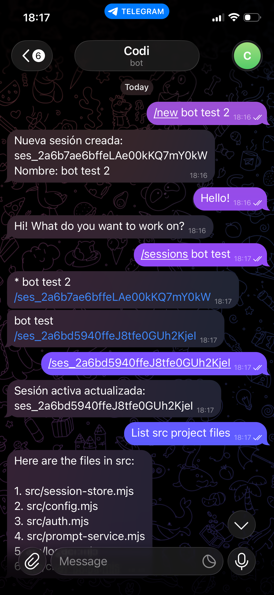

# opencode-telegram

Telegram bot that bridges your chats to an OpenCode server. Control coding sessions from your phone.

> Not affiliated with the SST/OpenCode team.

<p align="center"></p>

## Requirements

- Node.js 20+
- [OpenCode](https://opencode.ai) installed (`brew install sst/tap/opencode` or equivalent)
- A Telegram bot token from [@BotFather](https://t.me/BotFather)

## Setup

Create `~/.config/opencode/telegram-bot.json`:

```json
{
  "botToken": "your-telegram-bot-token",
  "username": "your-opencode-username",
  "password": "your-opencode-password",
  "allowedFingerprints": ["*"]
}
```

Run both processes from your project directory:

```bash
npm install
npm start
```

Or run them separately in two terminals:

```bash
npm run start:opencode   # terminal 1
npm run start:telegram   # terminal 2
```

To restart, stop the process (`Ctrl+C`) and run it again.

## Access control

The bot uses `allowedFingerprints` to authorize users. A fingerprint is your Telegram user ID.

| Value | Behavior |
|-------|----------|
| `[]` or omitted | Deny all (default) |
| `["*"]` | Discovery mode — replies with your fingerprint, no access granted |
| `["123456789"]` | Allowlist — only that user ID can interact |

To find your fingerprint, set `["*"]` and send `/fingerprint` to the bot. Then switch to your user ID:

```json
{
  "allowedFingerprints": ["123456789"]
}
```

## Configuration reference

| Field | Required | Default | Description |
|-------|----------|---------|-------------|
| `botToken` | yes | — | Telegram bot token |
| `username` | yes | — | OpenCode server username |
| `password` | yes | — | OpenCode server password |
| `allowedFingerprints` | no | `[]` | Array of authorized Telegram user IDs, or `["*"]` for discovery |
| `baseUrl` | no | `http://127.0.0.1:4096` | OpenCode server URL |
| `model` | no | OpenCode default | Model in `provider/model` format, e.g. `anthropic/claude-sonnet-4-5` |
| `storePath` | no | `~/.local/share/opencode/telegram-sessions.json` | Path to session store |
| `pollIntervalMs` | no | `1000` | Polling interval when SSE is unavailable |
| `pollTimeoutMs` | no | `3600000` | Max wait time per response |

## Commands

- `/start` — create or resume the session for this chat
- `/new <optional_name>` — create a new session
- `/rename <name>` — rename the current session
- `/stop` — abort the current execution
- `/verbose` — toggle progress traces (ON/OFF)
- `/verbose 1|0` — enable or disable progress traces
- `/status` — show active session name and verbose state
- `/sessions <optional_filter>` — list sessions, optionally filtered by name
- `/switch <session_id>` — switch active session
- `/<session_id>` — shortcut to switch session (e.g. `/ses_abc123`)
- `/delete <session_id>` — delete a session
- `/restart` — exit the bot process (use your process manager or shell to restart it)
- `/fingerprint` — show your Telegram user ID for allowlist setup
- `/help` — show command list

## Real-time progress

The bot uses SSE as the primary channel for progress updates. With `verbose` ON (default), it sends traces during execution: session status, tool calls with input summaries, step events, and retries.

